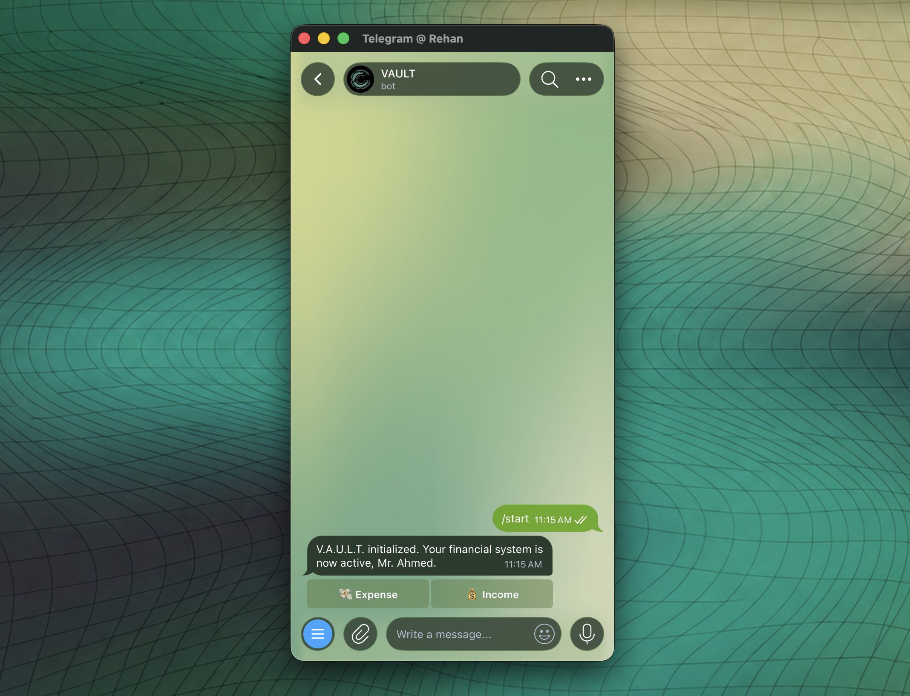
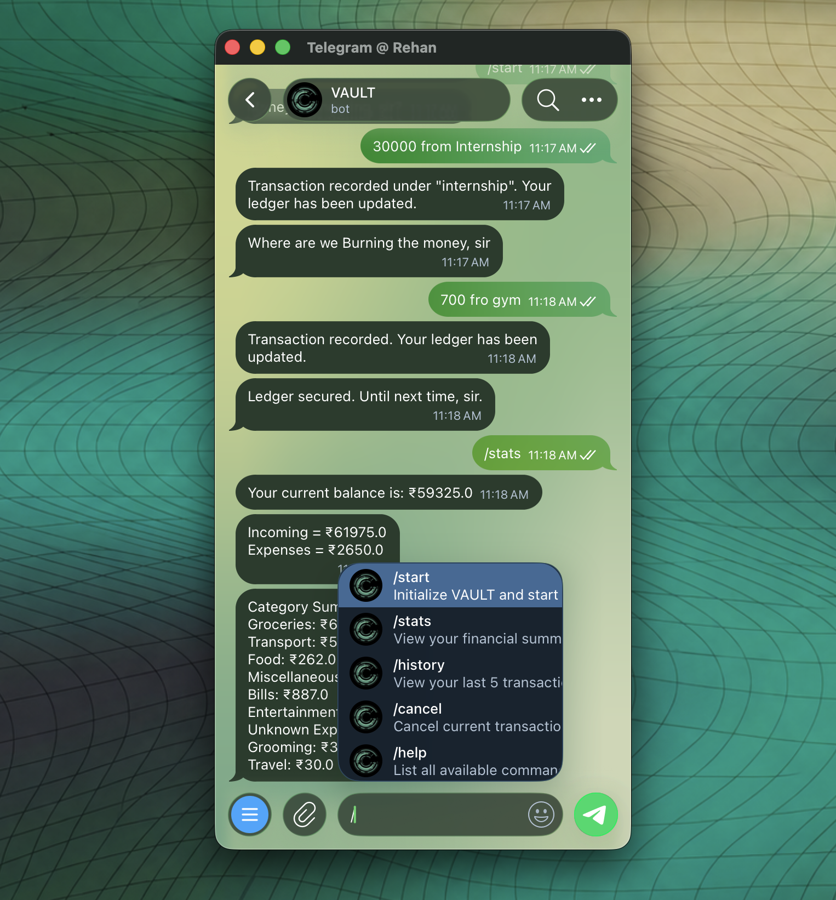
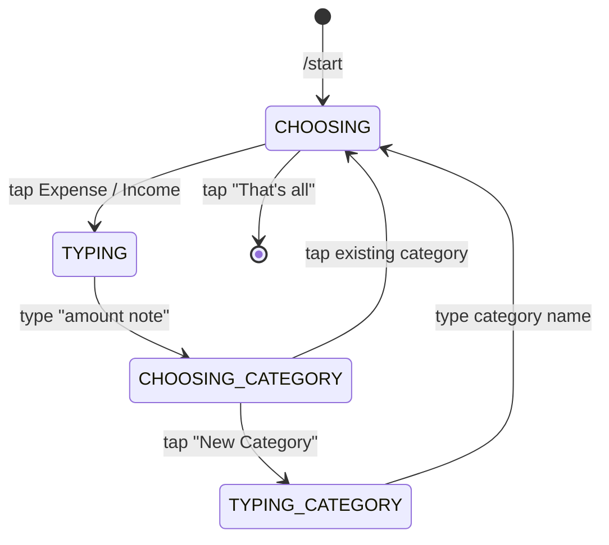
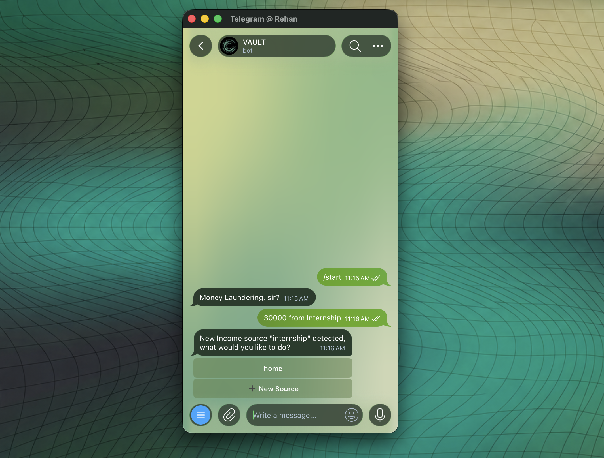
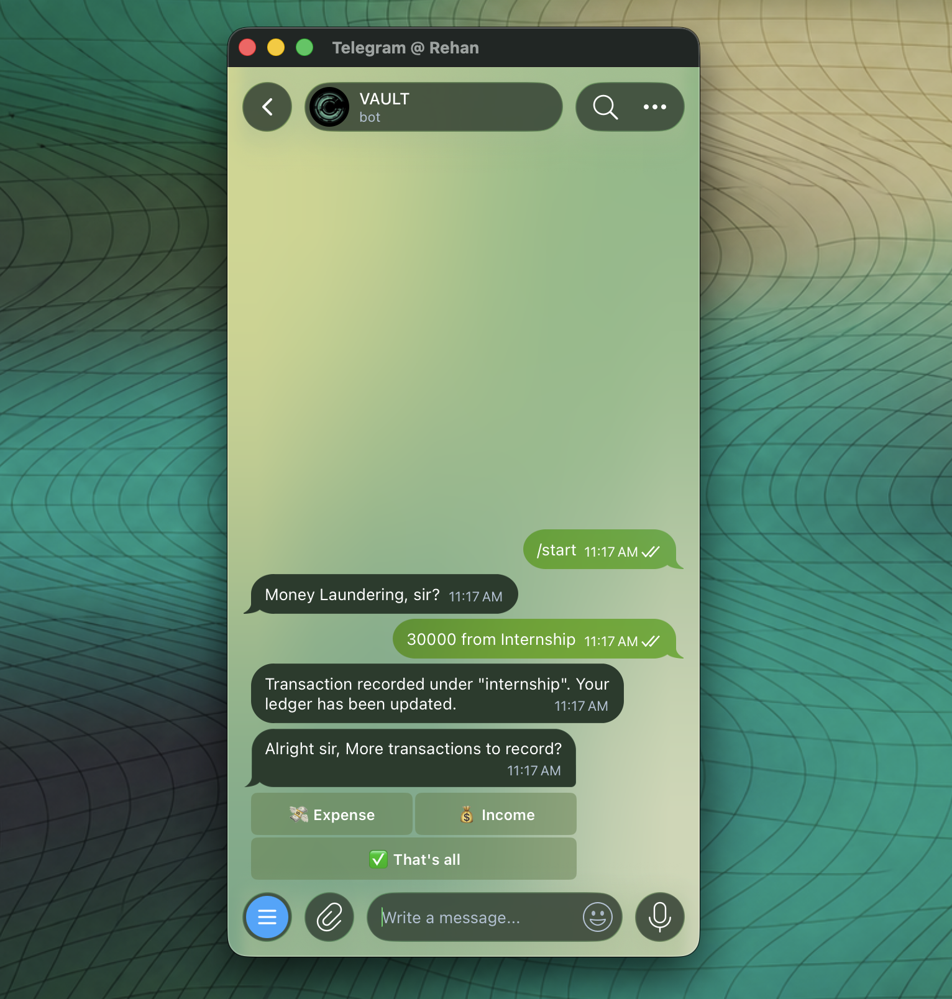
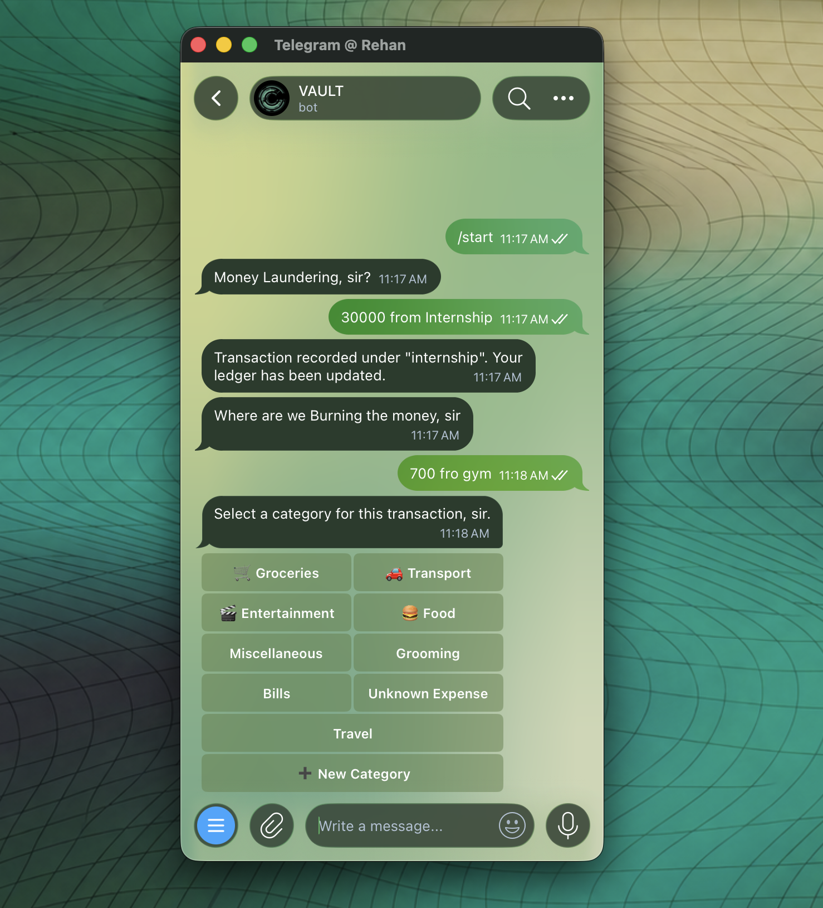
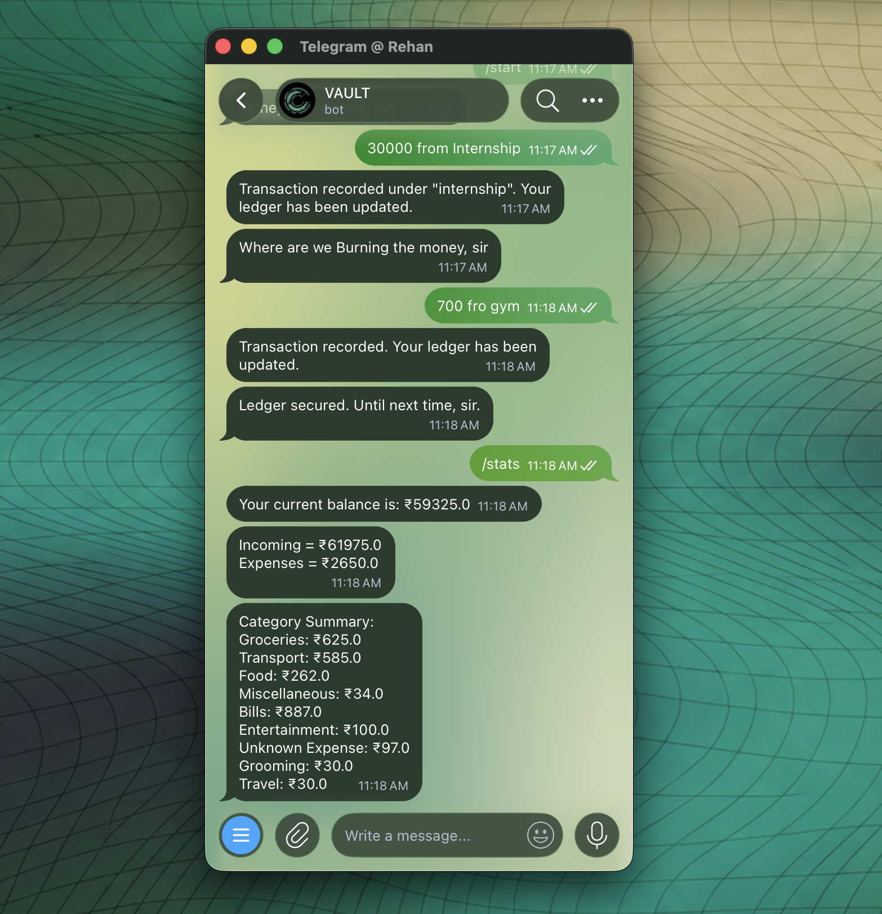
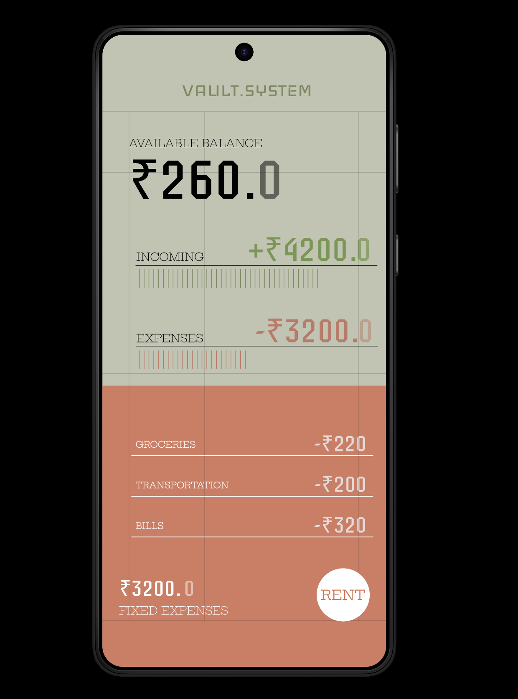

# V.A.U.L.T.

**VAULT(Virtual Assistant for Unified Ledger Tracking) A personal finance tracking Telegram bot.**

Talk to it at [`@vaultProtocol_bot`](https://t.me/vaultProtocol_bot) — no repo clone, no setup, just add the bot and start logging. VAULT records income and expenses through a fully button-driven conversation: every decision point is a tap, not a memorized command.

<p align="center">
  
</p>

---

## Why button-driven, not command-driven

Most "quick" trackers make you type structured commands (`/expense 500 food groceries`). That's fast to build and easy to abandon — remembering syntax is exactly the kind of friction that kills a habit-forming tool.

<p align="center">
  
</p>

VAULT flips that: expense vs. income, which category, what to view — all taps. The only typed input is the one thing that genuinely can't be a button: an amount and a short note.

## Architecture: a conversation as an explicit state machine

The bot's core is a `ConversationHandler` with four states:



Each state maps to a specific handler list, and that mapping is stricter than it looks — a `MessageHandler` bound to `TYPING` can't catch a `CallbackQuery`, so a stray button tap while the bot expects free text gets silently swallowed rather than erroring loudly. Getting the transitions right, and returning an explicit target state from every handler instead of relying on `None` to preserve state, is what keeps the conversation from getting stuck.

**Key engineering decisions:**

- **Explicit state returns everywhere.** `python-telegram-bot` will preserve the current state on a `None` return, but that's an implicit library default. Every handler here returns its target state explicitly, so control flow is readable from the code alone.
- **Single write path.** All persistence goes through `record_transaction()` in `Database.py` — no handler writes to the database directly.
- **Dynamic category buttons.** Expense categories aren't a fixed list — `typing_handler` pulls past custom categories out of the transaction history and merges them with the defaults, so frequently-used categories become tappable without any manual setup.
- **No schema bloat for a "soft" feature.** Income sources aren't a separate stored field — they're derived from existing `category` values across past transactions.
- **Callback data collisions handled deliberately.** History filters (`expense_history`, `income_history`, `both_history`) use a distinct suffix pattern so they never collide with category or transaction-type callbacks in the same handler.

### Automated income Logging
<p align="center">
  
</p>

A new income source is detected automatically and offered as a button — no manual setup required.

### Transaction recorded
<p align="center">
  
</p>

Straight back to the main menu after every entry, ready for the next one.

### Logging an expense
<p align="center">
  
</p>

Categories are built dynamically from past transactions, not hardcoded. Users have full independence in creating and categorizing their own expenses.

### /stats
<p align="center">
  
</p>

Refer to the current status section to see how Pillow will be used to send stats in the future and improve the user experience. Balance, totals, and a full category breakdown on demand.
## Tech stack

- Python 3
- [`python-telegram-bot`](https://github.com/python-telegram-bot/python-telegram-bot) — conversation handling, inline keyboards
- PostgreSQL (`psycopg2`) — transaction storage
- `python-dotenv` — local environment config
- Deployed on Railway via GitHub auto-deploy

## Project structure

```
VAULT/
├── src/
│   ├── models.py     # Transaction data model
│   ├── logic.py      # Balance, summaries, category logic
│   ├── Database.py   # PostgreSQL connection & queries
│   └── bot.py         # Conversation states & Telegram handlers
├── .env               # BOT_TOKEN, DATABASE_URL (not committed)
├── Procfile           # Railway worker process
└── requirements.txt
```

## Running it locally

```bash
git clone https://github.com/<your-username>/VAULT.git
cd VAULT
python -m venv .venv
source .venv/bin/activate
pip install -r requirements.txt
```

`.env`:

```
BOT_TOKEN=your_telegram_bot_token_here
DATABASE_URL=your_postgres_connection_string_here
```

```bash
python src/bot.py
```

## Current status

Core conversation flow — expense/income logging, dynamic categories, history, stats — is live and running against Postgres. In active development:

<p align="center">
  
</p>

Stats card mockup — Pillow-rendered version in progress.

- [ ] Per-user data isolation (currently single-tenant while the bot is in early testing)
- [ ] `/help` command and improved onboarding for first-time users
- [ ] Suggested categories surfaced as quick-tap buttons (logic exists, not wired into the UI yet)
- [ ] Visual stats card (Pillow-rendered, design in Figma)
- [ ] Monthly report generation

## License

Apache License
